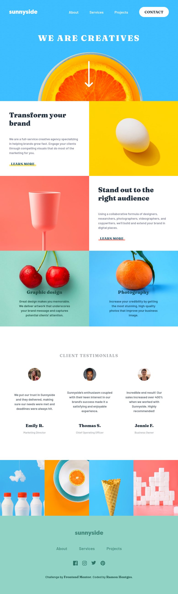

# Frontend Mentor - Sunnyside agency landing page solution

This is a solution to the [Sunnyside agency landing page challenge on Frontend Mentor](https://www.frontendmentor.io/challenges/sunnyside-agency-landing-page-7yVs3B6ef). Frontend Mentor challenges help you improve your coding skills by building realistic projects.

## Table of contents

- [Overview](#overview)
  - [The challenge](#the-challenge)
  - [Screenshot](#screenshot)
  - [Links](#links)
- [Built with](#built-with)
- [Author](#author)

## Overview

### The challenge

Users should be able to:

- View the optimal layout for the site depending on their device's screen size
- See hover states for all interactive elements on the page

### Screenshot

### Links

- Solution URL: [Solution](https://github.com/ramonhentges/sunnyside-agency-landing-page-frontendmentor)
- Live Site URL: [Live Site](https://ramonhentges.github.io/sunnyside-agency-landing-page-frontendmentor/)

### Built with

- Semantic HTML5 markup
- Flexbox
- Mobile-first workflow
- Tailwind CSS

## Author

- LinkedIn - [LinkedIn](https://www.linkedin.com/in/ramon-hentges-9b6b74216/)
- Frontend Mentor - [@ramonhentges](https://www.frontendmentor.io/profile/ramonhentges)
